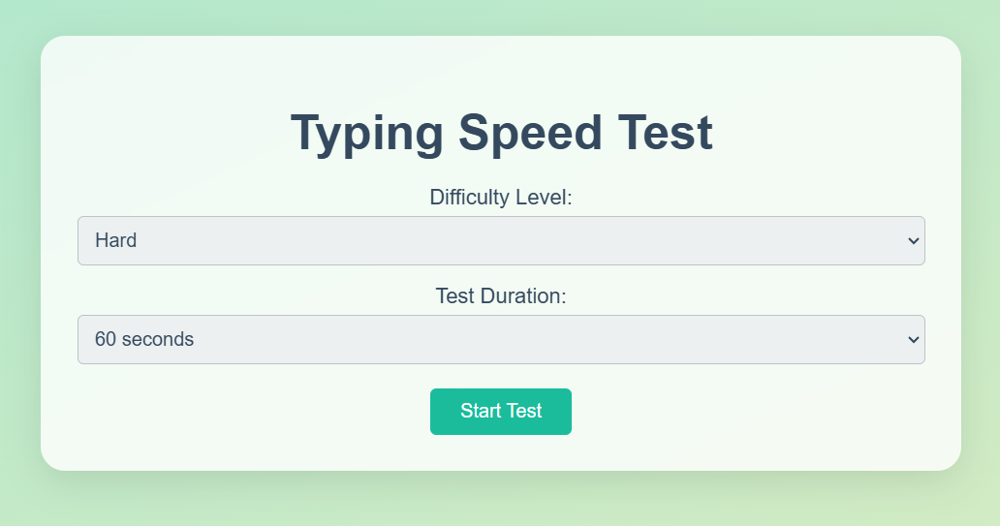
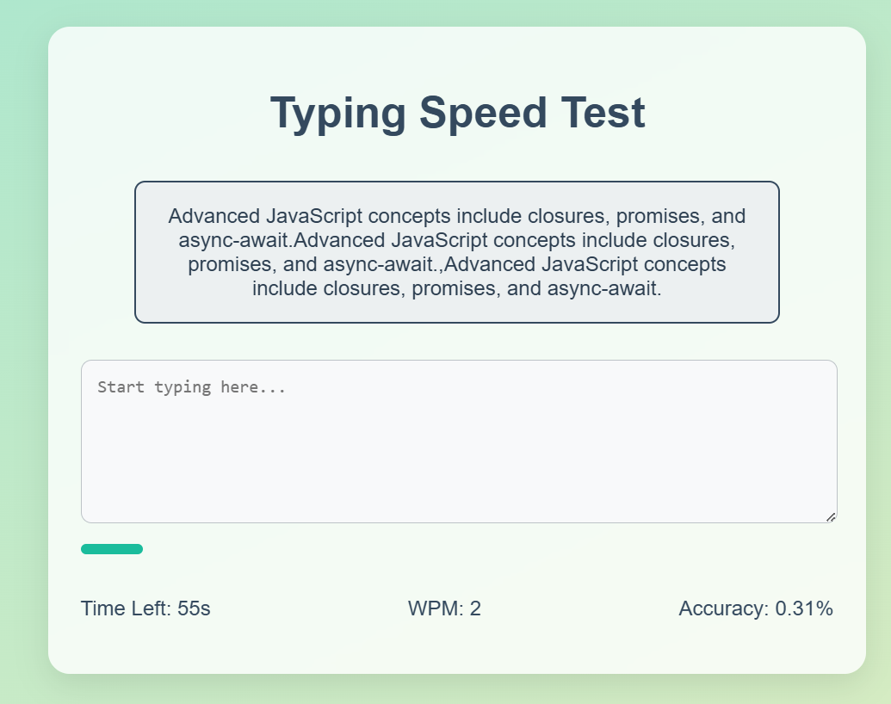
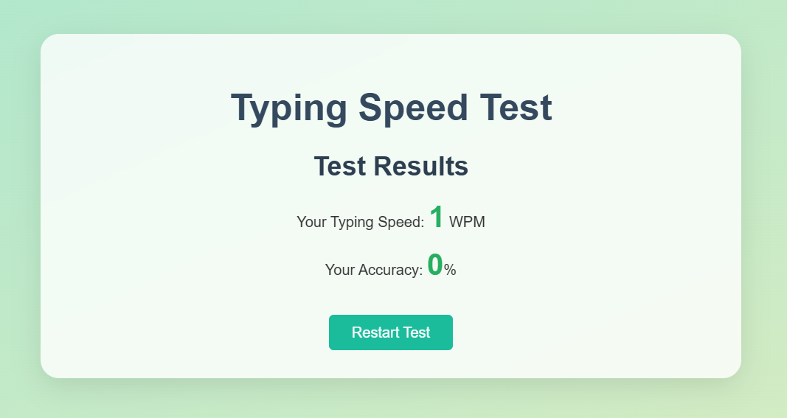

# Typing Speed Test

A web application designed to measure and improve typing speed and accuracy. Users can test their typing skills by typing a given set of text within a specified time.

## Features

- **Real-Time Speed Tracking:** Displays typing speed (words per minute) as you type.
- **Accuracy Measurement:** Tracks and displays the percentage of correctly typed characters.
- **Dynamic Texts:** Offers a variety of texts for practice.
- **User-Friendly Interface:** Clean and responsive design suitable for all devices.
- **Difficulty Levels:** Three difficulty levels - Easy, Medium, and Hard.

## Usage

1. Open the app in any modern web browser.
2. Select a difficulty level.
3. Start typing the displayed text.
4. View your typing speed and accuracy in real-time.
5. Complete the test to see your final results.

## Technologies Used

- **HTML5** for the structure.
- **CSS3** for styling.
- **JavaScript** for functionality.

## How to Run

1. Clone the repository to your local machine.
2. Open the `index.html` file in your preferred web browser.

## File Structure

- `index.html`: The main HTML file that contains the structure of the typing speed test app.
- `style.css`: The CSS file for styling the app.
- `script.js`: The JavaScript file that contains the logic for the app.

## Screenshots

## License

This project is licensed under the MIT License.
